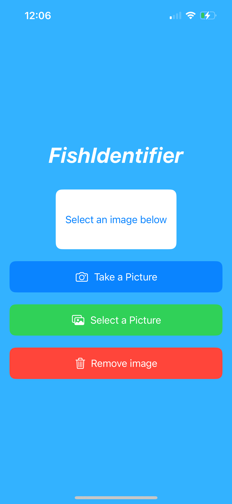

# Fish Identifier 🐟
iOS app to analzye common fish species in North America.

  
  

## Model Development
- The FishIdentifier classification model was trained on top of MobileNetV3Large in Tensorflow
- Images were sourced using the iNaturalist API
- Model achieved an overall accuracy of about 75% on test data
- See model.ipynb, data_collection.ipynb for image collection and model training

## App Development
- The iOS app is implemented entirely in Swift, SwiftUI
- Vision, CoreML used to implement model in Swift
- Single page application, the user is prompted to select an image, then the top 3 predictions are listed from the model

## Current working developments
- Working to add user authentication
- Developing tracking functionality for users to keep track of species caught

## Acknowledgements
- Special thanks to iOS Academy, Mark Kraay for their content on implementing Tensorflow models in Swift!
